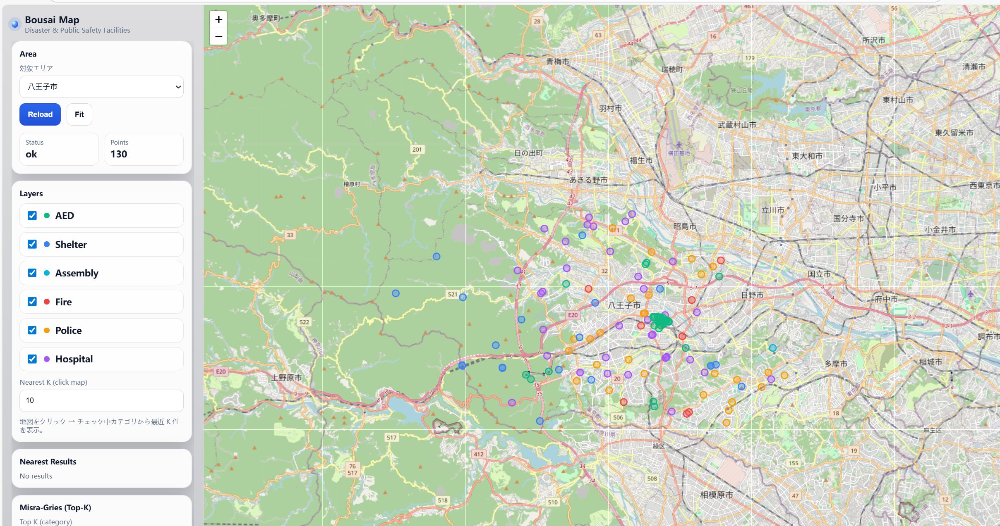
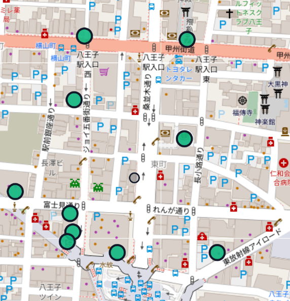
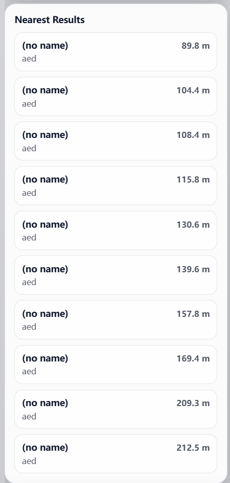
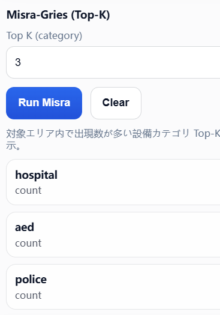
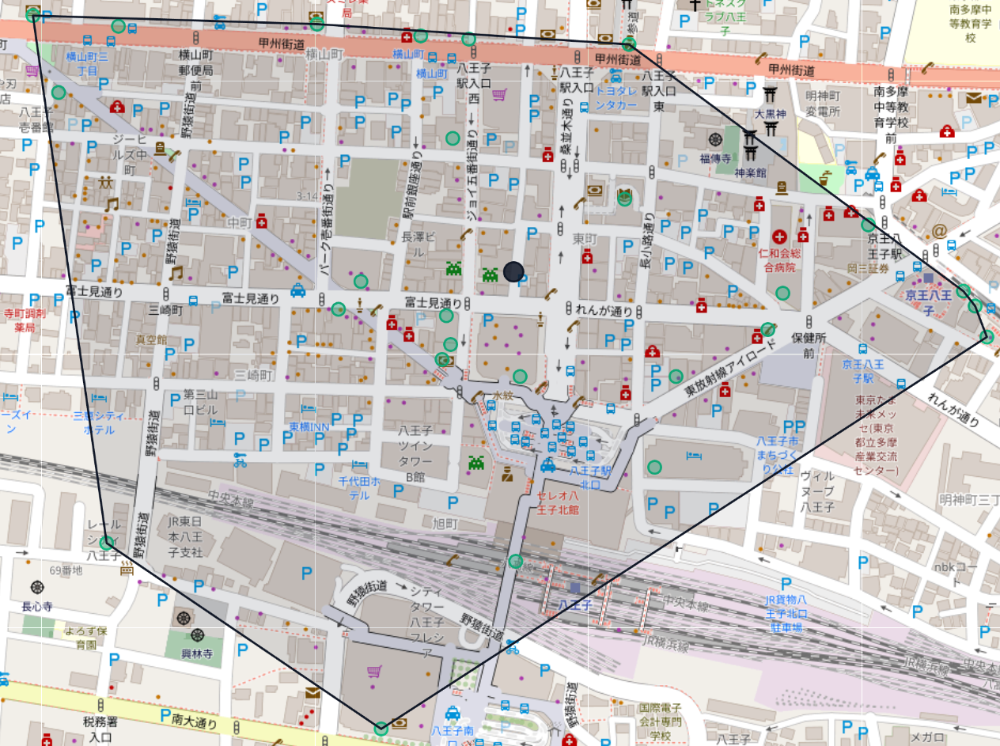
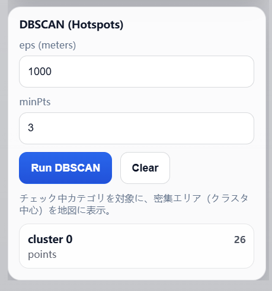

# DayLast – 防災・公共安全施設 空間分析 Web GIS アプリ

## 1. チーム・学修番号・氏名

- チーム:C 学修番号：22141114 氏名：馬少卿

---

## 2. 実装システム名

**Bousai Map – Disaster & Public Safety Facilities Web GIS**

---

## 3. システム概要

本システムは，防災および公共安全施設（AED，避難所，集合場所，消防署，警察署，病院など）を  
地図上に可視化し，空間アルゴリズムを用いて分析を行う Web GIS アプリケーションである。

施設の配置状況を直感的に把握するだけでなく，

- 近くにある施設は何か  
- どの区にはどの種類の施設が多いか  
- 施設のカバーが十分な地域・不足している可能性のある地域はどこか  

といった防災・公共安全の観点で重要な情報を，数値的・視覚的に確認できることを目的としている。



---

## 4. データについて

- データソース：OpenStreetMap（OSM）公開データ  
- 取得方法：Overpass API を用いて GeoJSON 形式で取得  
- 対象地域：東京都23区および八王子市  

取得したデータは以下の流れで前処理を行っている。
```text
data/raw/*.geojson
        ↓
scripts/build_dataset.js
        ↓
data/processed/*_points.geojson
```
各施設は以下の情報を持つ点データとして管理されている。

- 緯度・経度  
- 施設カテゴリ（aed, shelter, assembly_point, fire_station, police, hospital）  
- 施設名  
- OSM のタグ情報  

---

## 5. 実装機能

### 機能1：最近傍施設検索（R-tree）

- 地図上をクリックすると，その地点を基準として最近傍 K 件の施設を表示  
- 各施設までの距離（m）を計算し，近い順に一覧表示する  

アルゴリズム：
- R-tree（空間インデックス）
  - 施設点を矩形領域で階層的に管理
  - 不要な領域を剪定することで探索を高速化
  - 全点探索を避け，効率的な最近傍検索を実現
 




---

### 機能2：区ごとの Top-3 施設カテゴリ集計（Misra–Gries）

- 東京23区それぞれについて，出現数が多い施設カテゴリ Top-3 を算出  
- 区ごとの防災・公共安全資源の特徴を定量的に比較可能  

目的：
- 区ごとにどの設備が充実しているかを明確化  
- 防災体制の地域差・偏りを可視化  

アルゴリズム：
- Misra–Gries（Heavy Hitters）
  - 出現頻度の高いカテゴリ候補を少数のカウンタで保持
  - 少ないメモリで高速に Top-K を抽出可能
    


---

### 機能3：施設カバー範囲の可視化（DBSCAN）

- DBSCAN により施設の密集領域をクラスタとして抽出  
- 実質的な「施設のカバー範囲」を視覚的に把握可能  

解釈：
- クラスタが形成される → カバーが十分な可能性が高いエリア  
- ノイズ・空白が多い → カバーが弱い可能性があるエリア  

アルゴリズム：
- DBSCAN（Density-Based Spatial Clustering of Applications with Noise）
  - eps（距離），minPts（最小点数）により密集領域を定義
  - クラスタ数を事前に決める必要がなく，自動抽出が可能
  - 




---

## 7. ディレクトリ構成

```text
DayLast/
├─ server.js
├─ package.json
├─ README.md
├─ data/
│  ├─ raw/
│  ├─ processed/
│  └─ areas.json
├─ scripts/
├─ algorithms/
└─ public/
```


